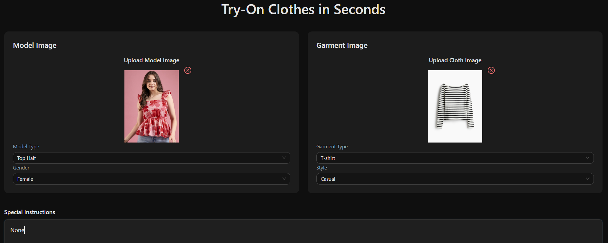
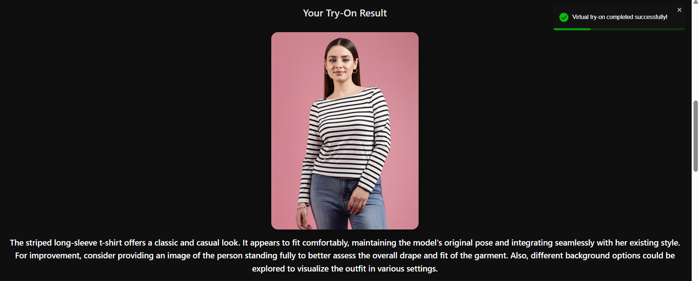
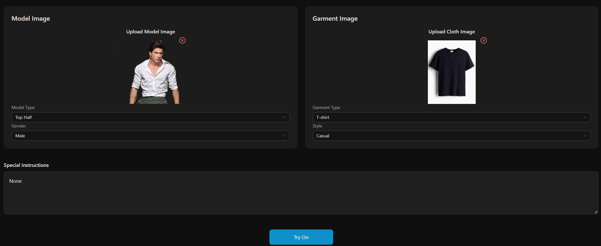
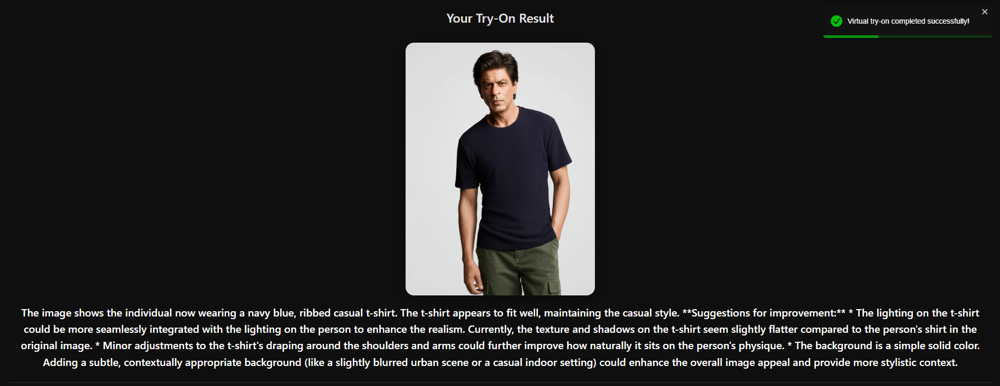

# 👗 Gen AI Virtual Try-On Clothes

An AI-powered virtual try-on web app that allows users to upload a photo of a person and a clothing item to generate realistic outfit previews using Google Gemini. This project combines Generative AI, FastAPI, and React.js to deliver a high-fidelity, seamless try-on experience — perfect for fashion tech, e-commerce, or virtual fitting rooms.

---

## 🚀 Features

- Upload any **model image** and **clothing image**
- Get **realistic AI-generated try-on previews**
- Preserves facial identity and garment texture
- Auto background removal and clean garment overlay
- Responsive React frontend with dark/light mode
- Local session-based try-on history

---

## 🖼️ Screenshots

<p align="center">
   
   
   
</p>

---

## 🛠️ Tech Stack

| Frontend           | Backend         | AI & Processing              |
|--------------------|------------------|------------------------------|
| React.js           | FastAPI          | Google Gemini (Generative AI) |
| Tailwind CSS       | Uvicorn (ASGI)   | Image-to-Image Inference     |
| Axios, Toastify    | Pydantic         | Background Removal, Encoding |

---

## ⚙️ Setup Instructions

### 1. Clone the Repository

```bash
git clone https://github.com/Honey1707/GenAI-Virtual-TryOn-Cloths.git
cd GenAI-Virtual-TryOn-Cloths
