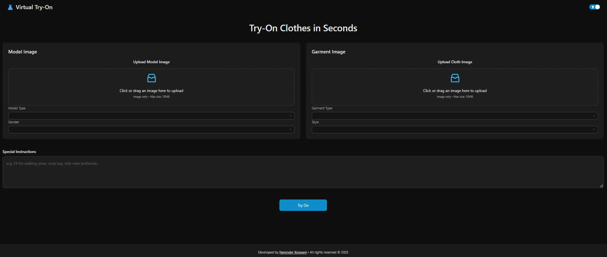

<<<<<<< HEAD
# 👗 Gen AI Virtual Try-On Clothes

A cutting-edge, Gen AI-powered virtual try-on web application that enables users to upload a person (model) image and a clothing item image to generate photorealistic try-on previews in seconds. Built using Google Gemini (Generative AI) and FastAPI, this tool delivers high-fidelity outfit visualization, facial identity preservation, background replacement, and seamless garment rendering—perfect for fashion tech, e-commerce, and virtual fitting room experiences.

---

## 🚀 Features

- Upload any **person image** and **clothing item**
- Generate **AI-based try-on images** with high fidelity
- Preserves facial identity and garment texture
- Automatically removes and replaces the background
- Responsive UI with **dark/light mode**
- View and save **previous try-on history** in session only

---

## 🖼️ Screenshots




---

## 🛠️ Tech Stack

| 🖥️ Frontend           | ⚙️ Backend       | 🤖 AI & Processing       |
|------------------------|------------------|--------------------------|
| React.js               | FastAPI          | Google Gemini API (Generative AI) |
| Ant Design (UI Library)| Uvicorn (ASGI)   | Image-to-Image Inference |
| Axios (API Calls)      | Python 3.12+     | Base64 Encoding/Decoding |
| React Toastify         | Pydantic         | Multimodal Content Handling |

---

## ⚙️ Setup Instructions

### 1. Clone the Repo

```bash
git clone https://github.com/narender-rk10/Gen-AI-Virtual-Try-On-Clothes.git
cd Gen-AI-Virtual-Try-On-Clothes
```

### 2. Setup Backend

```bash
cd backend
poetry install
poetry shell
```

Create a `.env` file and add:

```
GEMINI_API_KEY=your_gemini_api_key_here
```

Run the server:

```bash
uvicorn main:app --reload
```

### 3. Setup Frontend

```bash
cd frontend
npm install
npm run dev
```

---

## 📦 API Endpoint

```
POST /api/try-on
```

- `person_image`: UploadFile (image)
- `cloth_image`: UploadFile (image)
- `instructions`, `model_type`, `gender`, `style`, `garment_type`: FormData

---

## 📁 Project Structure

```
/frontend       # React + Ant Design UI
/backend        # FastAPI + Gemini AI API
```

---

---

## 🤝 Contributing

Pull requests are welcome. For major changes, please open an issue first to discuss what you’d like to change.

---

## 📄 LICENSE:
<a rel="license" href="http://creativecommons.org/licenses/by-nc-nd/4.0/"></a><br />This work is licensed under a <a rel="license" href="http://creativecommons.org/licenses/by-nc-nd/4.0/">Creative Commons Attribution-NonCommercial-NoDerivatives 4.0 International License</a>.

---

## 💡 Inspiration

This was built to explore fashion AI possibilities using state-of-the-art multimodal LLMs like **Google Gemini**.

---

## 🙋‍♂️ Author

**Narender Keswani**  
🔗 [GitHub](https://github.com/narender-rk10) | 💼 [LinkedIn](https://linkedin.com/in/narender-keswani) | 🌐 [Website](https://www.narenderkeswani.com)
=======
# GenAI-Virtual-TryOn-Cloths
>>>>>>> d10fa6a3fa286cde218df2930466389f664e8cf8
